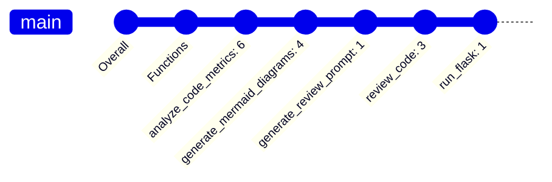
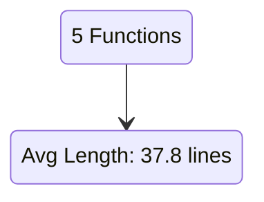

# 🤖 AI Code Review Report

## Overview

**Files Reviewed:** 1

## Repository Metrics

- Total Lines of Code: 218
- Total Functions: 5
- Average Complexity: 3.00

## Repository Overview

### Complexity Analysis

### Function Metrics

### Review

This is a Flask API that provides a POST endpoint for submitting code for review. The endpoint calls the `run_flask()` function, which starts a Flask server.

The code for the endpoint includes the following:

1. It defines a `review_code()` function that takes a JSON payload containing the code to be analyzed and the filename of the code.
2. It uses the `requests` library to send a POST request to the Ollama API with the JSON payload. The API will generate a review text based on the code and return it in the response.
3. It defines a `generate_review_prompt()` function that takes the code and filename as input and generates a review prompt based on the analysis results.
4. It uses the `jsonify()` function to return the response to the client.
5. It includes an error handling mechanism in case of any exceptions.

The `run_flask()` function starts the Flask server and prints a message indicating that the server has started.

The code can be divided into the following sections:

1. The first section defines the `review_code()` function, which takes a JSON payload containing the code to be analyzed and the filename of the code as input. It uses the `requests` library to send a POST request to the Ollama API with the JSON payload, and it includes an error handling mechanism in case of any exceptions.
2. The second section defines the `generate_review_prompt()` function, which takes the code and filename as input and generates a review prompt based on the analysis results.
3. The third section includes the `run_flask()` function, which starts the Flask server.
4. The final section includes a message indicating that the server has started.

Overall, this code provides a simple API for submitting code for review and receiving the review results back in the response.

---

